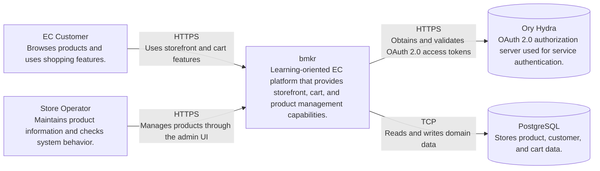
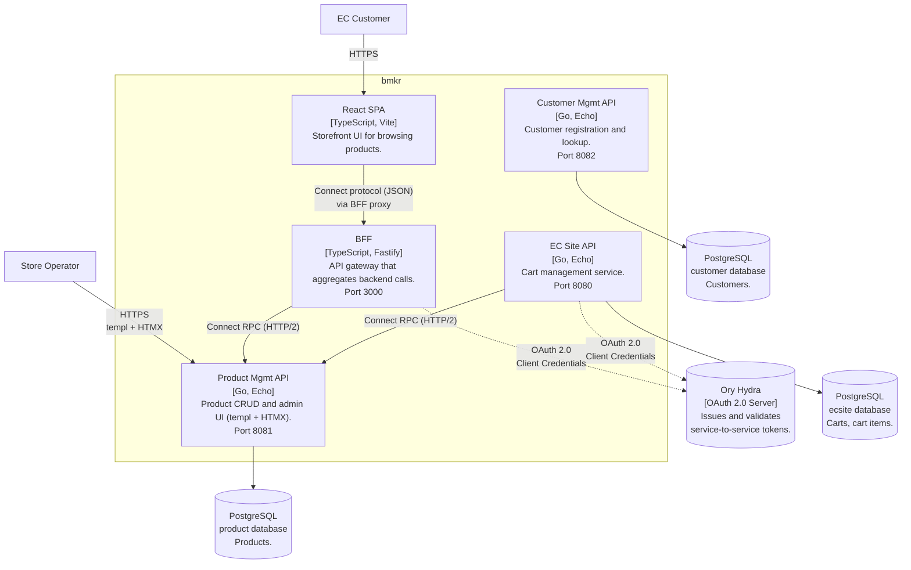

# bmkr C4 Overview

## Level 1: System Context

## Level 2: Container

> 実線 = 実装済み、点線 = ADR 決定済み・未実装

## File Mapping

| Container | Directory | Entry Point |
|-----------|-----------|-------------|
| React SPA | `services/ec-site/frontend/` | `src/App.tsx` |
| BFF | `services/bff/` | `src/index.ts` |
| EC Site API | `services/ec-site/` | `main.go` |
| Product Mgmt API | `services/product-mgmt/` | `main.go` |
| Customer Mgmt API | `services/customer-mgmt/` | `main.go` |

| Proto Definition | Path |
|------------------|------|
| ProductService | `proto/product/v1/product.proto` |
| CartService | `proto/ec/v1/cart.proto` |
| OrderService | `proto/ec/v1/order.proto` |
| CustomerService | `proto/customer/v1/customer.proto` |
