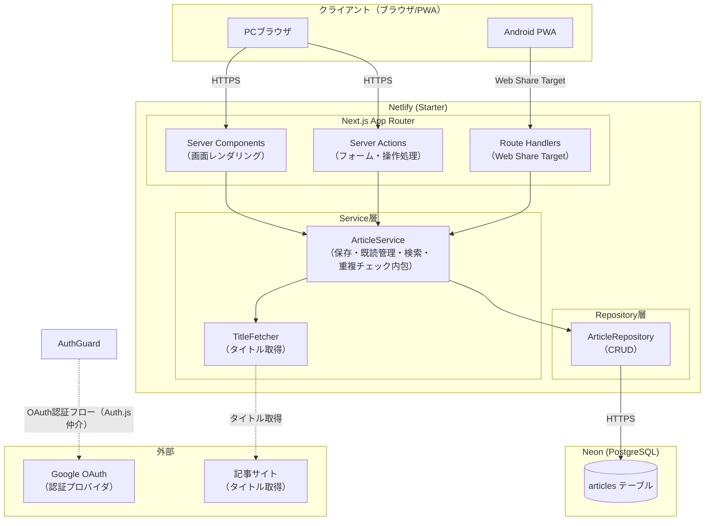
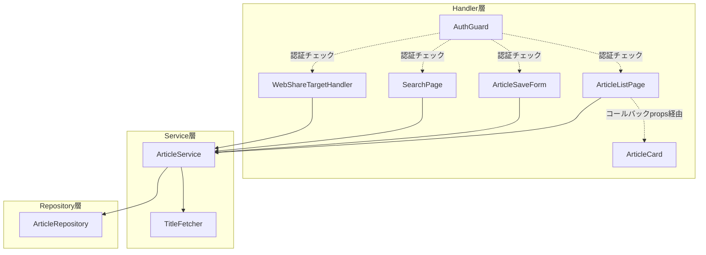

# クロスデバイス対応リーディングリスト管理ツール: システム設計書

## ステータス

Confirmed

## 日付

2026-02-26

## 入力文書

- 要件定義書: `docs/project-definition/requirements.md` (2026-02-19)
- ADR: `docs/adr/` (3件: ADR-0001, ADR-0002, ADR-0003)

## 1. システム概要

本システムは、RSSリーダー・X・Web閲覧中に見つけた記事URLを一元管理するリーディングリスト管理ツールである。スマートフォン（Android共有メニュー）とPCブラウザのいずれからでも記事を保存・閲覧・管理でき、未読状況をクロスデバイスで一元管理することを目的とする。

個人開発・シングルユーザー・月額0円運用という制約のもと、自作アプリとして実現する。Netlify（Starterプラン）上にデプロイするNext.js App Routerベースのモノリシックなフルスタックアプリケーションとして構成し、PWA（Web Share Target API）によりAndroid共有メニューとの連携を実現する。データはNeon（PostgreSQL）に永続保持し、Drizzle ORMによる型安全なアクセスを提供する。

## 2. アーキテクチャスタイル・パターン

### 2.1 アーキテクチャスタイル

**モノリシックアーキテクチャ**を採用する。

個人開発・シングルユーザー・シンプルCRUDという特性から、分散システムやマイクロサービス化の必要性がない。単一のNext.jsアプリケーションとしてフロントエンドとバックエンドを一体化し、開発・運用の複雑性を最小化する。

関連する非機能要件への対応:
- NFR-1（月額0円）: 単一アプリ＋Netlify Starter Planの構成で追加インフラコストなし
- NFR-2（運用負荷）: 単一リポジトリ・単一デプロイ単位で運用ステップを最小化

### 2.2 設計パターン

| パターン | 適用箇所 | 採用理由 |
|---------|---------|---------|
| 3層アーキテクチャ（Handler / Service / Repository） | アプリケーション全体 | ビジネスロジックとデータアクセスを分離し、各層の責務を明確化。テスト容易性と保守性の確保 |
| Repository パターン | データアクセス層 | データベース実装の詳細をサービス層から隠蔽。将来のDB変更・テスト時のモック化を容易にする |
| Server Components + Server Actions | UI/データフロー | Next.js App Routerの中心パターン。サーバーサイドレンダリングによるパフォーマンス確保とフォームハンドリングの簡素化 |
| Error Boundary | エラーハンドリング | Reactのエラー境界でUIレベルのエラーを補足し、アプリ全体のクラッシュを防止 |
| PWA（Progressive Web App） | クライアント配信 | インストール可能なWebアプリとしてAndroid共有メニュー連携（Web Share Target API）を実現 |

## 3. 技術スタック

| レイヤー | 技術 | ADR | 選定理由 | 検討した代替案と棄却理由 |
|---------|------|-----|---------|----------------------|
| ホスティング | Netlify (Starter) | ADR-0001 | プラットフォーム依存リスク最小、FW/DB選定の自由度最大、商用利用可能な無料枠 | ADR-0001参照 |
| フルスタックFW | Next.js (App Router) | ADR-0002 | 開発継続性・要件実現・依存リスクの全評価で最高評価、最大エコシステム | ADR-0002参照 |
| 言語 | TypeScript | — | 型安全性によるバグ防止、IDEサポート、ADR-0002で必須制約として確定 | 代替なし（制約による確定） |
| ランタイム | Node.js | ADR-0002 | Netlify標準ランタイムとの完全互換性、ADR-0002確定 | Bun: Netlify互換性不確実、本番実績不足 |
| パッケージマネージャ | pnpm | ADR-0002 | インストール速度・幻影依存防止・モノレポ対応力でnpm/yarn系を上回る | npm: 幻影依存リスク、Yarn Classic: メンテナンスモード |
| データベース | Neon (PostgreSQL) | ADR-0003 | HTTPベース接続によるサーバーレス適合、スケールゼロ、無料枠の十分性 | ADR-0003参照 |
| ORM | Drizzle ORM | ADR-0003 | TypeScript型安全・軽量（~7.4kb）・PostgreSQL機能透過的利用 | ADR-0003参照 |
| 認証ライブラリ | Auth.js | — | Next.js App Router対応の実績最多、OAuth統合が容易 | Lucia Auth: 事例・情報量が少ない |
| 認証プロバイダ | Google OAuth | — | Netlify + Next.js構成での実績、認証ロジックを外部委譲 | 独自認証: シングルユーザー用途では実装コスト過大 |
| UIフレームワーク | Tailwind CSS | — | ユーティリティファーストでボイラープレート削減、shadcn/uiとのエコシステム統一 | CSS Modules: 記述量増大 |
| UIコンポーネント | shadcn/ui | — | Tailwind CSS前提で追加インストール最小、カスタマイズ容易 | MUI/Chakra UI: Tailwindとの二重管理が発生 |
| フォームバリデーション | Zod | — | TypeScript型推論との親和性最高、Server Actionsでのランタイム検証に適合 | Yup: TypeScript型推論でZodに劣る |
| PWA | next-pwa（またはサービスワーカー直接実装） | — | Web Share Target API実現に必要、最小限のサービスワーカー構成 | 代替なし（PWA対応の実現手段として選定） |
| クライアント状態管理 | React組み込み (useState/useReducer) | — | シンプルCRUDでグローバル状態管理ライブラリ不要 | Redux/Zustand: このアプリ規模では過剰 |

## 4. アーキテクチャ概要

### 4.1 レイヤー構成

3層構成（Handler / Service / Repository）を採用する。各層の責務を明確に分離し、依存方向を上位から下位へ一方向に保つ。

| 層 | 別名 | 責務 | 主な技術 |
|----|------|------|---------|
| Handler層 | プレゼンテーション層 | HTTPリクエストの受付、レスポンス生成、入力バリデーション | Server Components, Server Actions, Route Handlers |
| Service層 | ビジネスロジック層 | ユースケースの実現、ビジネスルールの適用（重複チェック等） | TypeScriptクラス/関数 |
| Repository層 | データアクセス層 | DBへのCRUD操作、クエリの組み立て | Drizzle ORM, Neon PostgreSQL |

バリデーションはHandler層でZodを用いて実施する。バリデーション済みデータのみService層へ渡す。

### 4.2 コンポーネント図



関連SR: SR-001, SR-002, SR-004, SR-005, SR-017
関連NFR: NFR-3（応答性能）, NFR-4（セキュリティ）

## 5. コンポーネント設計

### 5.1 コンポーネント一覧

| コンポーネント | 責務 | 技術 | 関連SR |
|-------------|------|------|--------|
| ArticleListPage | 未読/既読一覧の表示、未読件数・蓄積警告の表示 | Server Component | SR-004, SR-011, SR-012, SR-013 |
| ArticleSaveForm | URL入力フォーム（PCブラウザ経由の保存） | Server Component + Server Action | SR-001, SR-014, SR-016 |
| SearchPage | 検索キーワード入力、検索結果一覧表示 | Server Component + Server Action | SR-009 |
| ArticleCard | 個別記事の表示（タイトル・日時）。操作ボタン（既読化・未読戻し・削除）はClient Componentとして切り出し、Server Actionsを呼び出す。表示専用コンポーネントとして操作コールバック（`onMarkAsRead`, `onMarkAsUnread`, `onDelete`）をpropsで受け取る設計とする | Server Component（ボタン部分はClient Componentとして切り出し、Server Actionsを呼び出す） | SR-003, SR-006, SR-007, SR-008 |
| ArticleService | 記事の保存・既読化・未読戻し・削除・検索・重複チェックのビジネスロジック（重複チェックはprivateメソッドとして内包） | TypeScript Service | SR-001〜SR-018全般 |
| ArticleRepository | articlesテーブルへのCRUD操作 | Drizzle ORM | SR-001〜SR-018全般 |
| WebShareTargetHandler | Web Share Target API経由のURL受信処理 | Route Handler | SR-002, IR-001 |
| AuthGuard | 認証済みユーザーのみアクセス許可 | Auth.js Middleware | NFR-4, IR-003 |
| TitleFetcher | 記事URLからタイトルを取得する外部通信処理。タイムアウト: 3秒。SSRF対策として内部IPアドレス範囲へのリクエストを拒否し、HTTPSのみ許可する（SSRF対策はTitleFetcher内部で実施する。Handler層での追加フィルタリングは不要） | TypeScript Service | SR-001, SR-002, SR-015 |

**TitleFetcher SSRF対策の詳細**:
- URLのホスト部分を解決し、以下のプライベートIPアドレス範囲へのリクエストを拒否する:
  - RFC1918プライベートアドレス: 10.0.0.0/8、172.16.0.0/12、192.168.0.0/16
  - ループバック: 127.0.0.0/8
  - リンクローカル: 169.254.0.0/16
- 許可プロトコルをHTTPSのみに制限する（httpは拒否）
- HTTPリダイレクトを追跡する場合はリダイレクト先URLにも同様のフィルタリングを適用する（または`redirect: 'manual'`でリダイレクト追跡を無効化する）

**TitleFetcher失敗時のフォールバック動作**:
- タイムアウト（3秒）またはHTTPエラーが発生した場合、URLをタイトル代替として保存を続行する（業務エラー扱い）
- ユーザーには「タイトルを取得できませんでした（URLで保存しました）」旨のインラインメッセージを通知する
- 保存操作全体を中止しない（URLは正常に保存する）

**保存フローのタイムバジェット分析**:
記事保存（SR-001/SR-002）の処理フローはバリデーション → TitleFetcher外部通信（最大3秒）→ ArticleRepository DB書き込み → revalidatePathの直列処理となる。想定所要時間: TitleFetcher最大3秒 + DB接続確立（最大5秒、後述）+ DB書き込み約0.5秒 = 最大約8.5秒（コールドスタート発生時の最悪ケース）。ただしwarm-up ping（§9.5）によりDB接続は通常確立済みのため、コールドスタートなし時は約3.5秒となる。NFR-3の記事保存5秒上限に対して、コールドスタートなし時は範囲内となる。Neonコールドスタート発生時（DB接続タイムアウト5秒 + 書き込み0.5秒）との合算が5秒を超えるリスクがあるが、warm-up pingの正常稼働を前提に許容する。warm-up pingが機能せずコールドスタート超過が常態化する場合はTitleFetcher処理の非同期化（保存は即時完了しタイトル取得をバックグラウンド実行）を設計変更として検討する。

### 5.2 コンポーネント間依存関係



**注記**: §4.2のコンポーネント図はシステム全体の通信・依存の概観を示す。本図（§5.2）は3層アーキテクチャ内のコンポーネント間依存を詳細に示す。AuthGuardは§5.2のみに登場し§4.2ではAuth.jsを通じたOAuth認証フローとして表現されている。

ArticleCardはServer Componentとして表示責務のみを担い、操作コールバック（`onMarkAsRead`, `onMarkAsUnread`, `onDelete`）をpropsで受け取る。ArticleServiceへの直接依存はなく、Server Actionsの呼び出しはArticleListPage等の上位コンポーネントが担う。

関連SR: SR-001〜SR-018（全機能要件）
関連IR: IR-001, IR-002, IR-003

### 5.3 テスト設計方針

各層のテスト種別と責務範囲、および外部依存のDI（依存注入）方針を定義する。

**テスト種別と責務範囲**:

| テスト種別 | 対象層 | 責務 |
|----------|--------|------|
| 単体テスト | Service層（ArticleService、TitleFetcher） | ビジネスロジックの検証。外部依存（TitleFetcher、ArticleRepository）はモックに差し替えて実施 |
| 統合テスト | Repository層 + DB | ArticleRepositoryのDrizzle ORMクエリと実DBの組み合わせ検証 |
| E2Eテスト | Handler層〜DB全体 | ブラウザ操作シナリオ（記事保存・既読化・検索等）の動作確認 |

**DI（依存注入）設計方針**:
- TitleFetcherとArticleRepositoryはインターフェース（TypeScript `interface`）を定義する
- DI方式は**コンストラクタ注入**に統一する（理由: インスタンス生成時に依存関係が明示され、テスト時のモック差し替えが一貫したパターンで実施できる）
- ArticleServiceはコンストラクタで`ITitleFetcher`と`IArticleRepository`を受け取り、テスト時にモック実装への差し替えを可能にする
- Handler層はファクトリ関数（`createArticleService()`等）を通じてServiceのインスタンスを取得する

### 5.4 ディレクトリ構造・ファイル配置ポリシー

3層構造（Handler / Service / Repository）の配置方針を以下のとおり定義する。

```
src/
  app/                          # Handler層（Next.js App Router）
    (auth)/                     # 認証関連ページ
    (app)/                      # 認証済みアプリページ
      page.tsx                  # ArticleListPage
      search/
        page.tsx                # SearchPage
    api/
      share/
        route.ts                # WebShareTargetHandler
      ping/
        route.ts                # warm-up pingエンドポイント（認証対象外: §7.2参照）
    layout.tsx
  lib/
    services/                   # Service層
      article-service.ts        # ArticleService（重複チェック内包）
      title-fetcher.ts          # TitleFetcher
    repositories/               # Repository層
      article-repository.ts     # ArticleRepository
    interfaces/                 # DI用インターフェース定義（横断的配置）
      title-fetcher.interface.ts
      article-repository.interface.ts
    db/
      schema.ts                 # Drizzle ORMスキーマ定義
      migrations/               # マイグレーションSQLファイル
    types.ts                    # 共通型定義（ActionResult等）
    errors.ts                   # エラー型定義（AppError等）
  components/                   # Handler層の再利用可能UIコンポーネント
    article-card.tsx            # ArticleCard（表示専用）
    article-card-actions.tsx    # ArticleCardActions（操作ボタン、Client Component）
    article-save-form.tsx       # ArticleSaveForm
  middleware.ts                 # AuthGuard（Auth.js Middleware）
```

**配置基準**:
- `src/app/`: ルーティングに依存するページコンポーネント（`page.tsx`）およびAPIルート（`route.ts`）
- `src/components/`: 複数ページから再利用されるUIコンポーネント（Handler層の再利用可能部品）
- `src/lib/interfaces/`: Service層・Repository層両方にまたがるDI用インターフェース定義（横断的配置）

**命名規則**:
- ファイル名: kebab-case（例: `article-service.ts`）
- TypeScriptクラス・インターフェース名: PascalCase（例: `ArticleService`）
- DIインターフェースの型名: `I{ClassName}`（例: `ITitleFetcher`, `IArticleRepository`）
- 環境変数名: UPPER_SNAKE_CASE（例: `DATABASE_URL`、`ALLOWED_EMAIL`、`GOOGLE_CLIENT_ID`、`GOOGLE_CLIENT_SECRET`、`AUTH_SECRET`、`PING_SECRET`）

## 6. データ設計

### 6.1 エンティティ概要

MVPスコープでは `articles` テーブルを中心とするシングルテーブル構成とする。

| エンティティ | 説明 | 主な属性 |
|------------|------|---------|
| Article（記事） | リーディングリストの1件の記事エントリ | id, url, title, status（'unread' / 'read'）, saved_at, read_at |

### 6.2 スキーマ設計方針

- **主キー**: UUID（衝突なし、推測不可）。UUID生成はDB側のデフォルト値（PostgreSQLの`gen_random_uuid()`）を使用し、アプリ側での生成は行わない
- **URL**: UNIQUE制約（重複保存防止のDB側保証。UNIQUE制約により自動的にB-Treeインデックスが作成されるため、重複チェック用の個別インデックス設定は不要）
- **ステータス管理**: PostgreSQL ENUM型として定義する。Drizzle ORMでは`pgEnum`を使用して実装する（例: `const statusEnum = pgEnum('status', ['unread', 'read'])`）。将来の状態追加（例: `'archived'`）に対して拡張しやすく、クエリの可読性も高い
- **タイムスタンプ**: saved_at（保存日時）、read_at（既読化日時、NULL許容）をすべてのレコードに記録
- **インデックス**: status+saved_at（一覧表示のソート）に対してインデックスを設定
- **検索方式**: タイトルおよびURLに対するLIKE部分一致検索（SR-009）。中間一致（`LIKE '%keyword%'`）ではtitleへのB-Treeインデックスは使用されない。想定データ量の上限を5,000件とし、この件数でのシーケンシャルスキャンの想定所要時間は10ms以下と見込む（NFR-3の検索3秒以内を十分に満たす）。データが5,000件を超えた場合または検索応答が1秒を超えた場合を目安にpg_trgm拡張（GINインデックス）の導入を判断する（P2で閾値を計測・確認する）

データマイグレーション管理: Drizzle Kitによるスキーマ定義（TypeScriptファイル）からマイグレーションSQLを生成し、適用を管理する。スキーマ定義とTypeScript型が同一ファイルで管理されるため、スキーマ変更時のコンパイルエラーによる影響箇所の早期発見が可能。

関連SR: SR-003, SR-005, SR-006, SR-007, SR-008, SR-009, SR-010, SR-017
関連NFR: NFR-3（検索3秒以内）

## 7. 認証・アクセス制御

### 7.1 認証フロー

シングルユーザー前提のOAuth認証フローを採用する。アプリケーション内に認証ロジックを実装せず、Auth.jsとGoogle OAuthプロバイダに完全委譲する。

```
所有者 → ログイン画面 → Google OAuthリダイレクト → Google認証 → Auth.jsコールバック → シングルユーザー許可チェック → セッション確立 → アプリ画面
```

**シングルユーザー許可チェック**: Auth.jsの`callbacks.signIn`コールバックでGoogle OAuthから返されるメールアドレスを環境変数`ALLOWED_EMAIL`と照合し、不一致の場合は認証を拒否する。これにより、Googleアカウントを持つ任意の第三者がアプリにアクセスすることを防止する。

セッション管理はAuth.jsが提供するセッション機構に委譲する。P1ではAuth.jsのデフォルト設定（JWT有効期限: 30日）を採用する。セッション有効期限・CSRF設定の詳細はP2で確定する。

### 7.2 アクセス制御方針

| 制御ポイント | 方式 | 適用範囲 |
|------------|------|---------|
| 全ページ共通 | Auth.js Middleware によるセッション検証 | すべてのページ・APIルート（middleware除外パスを除く） |
| middleware除外パス | `/api/ping`（warm-up pingエンドポイント）を認証対象外とする。Auth.js Middlewareの`matcher`設定または条件分岐でこのパスを除外する | `/api/ping` |
| シングルユーザー制限 | `callbacks.signIn`でメールアドレスを`ALLOWED_EMAIL`環境変数と照合し、不一致の場合は認証拒否 | Google OAuthコールバック時 |
| Server Actions | セッション検証をAction冒頭で実施 | 保存・既読化・削除等の書き込み操作 |
| Route Handlers | セッション検証をHandler冒頭で実施 | Web Share Target APIエンドポイント |
| CSRF保護（Server Actions） | Next.js App RouterのビルトインCSRF保護（Originヘッダー検証）に依存 | Server Actions全般 |
| CSRF保護（Route Handlers） | **Originヘッダー検証**を採用する。リクエストの`Origin`ヘッダーをNetlifyのデプロイドメインと照合し、不一致の場合はリクエストを拒否する（実装: WebShareTargetHandler冒頭でOriginを検証し、許可ドメイン以外は403を返す） | WebShareTargetHandler（POSTリクエスト） |
| APIキー等シークレット | 環境変数で管理（ソースコードに含めない） | Google OAuthクライアントシークレット等 |
| 通信暗号化（クライアント→アプリ） | HTTPS強制（Netlify標準提供） | すべてのクライアント通信 |
| 通信暗号化（アプリ→DB） | Neon Serverless DriverはHTTPS（wss://）経由で接続 | アプリ→Neon間の通信 |

認証に成功した所有者本人のみがすべての機能を利用できる。未認証アクセスはログインページへリダイレクトする。

関連NFR: NFR-4
関連IR: IR-003

## 8. インフラストラクチャ

### 8.1 デプロイ構成

```
GitHub リポジトリ
    ↓ push to main（または pnpm run deploy 1コマンド）
マイグレーション実行（pnpm drizzle-kit migrate）※アプリデプロイ前に実行
    ↓
Netlify (Starterプラン)
    - ビルド: pnpm install && pnpm run build
    - デプロイ: サーバーレス関数 + 静的アセット配信
    ↓ DB接続（HTTPS/wss）
Neon (PostgreSQL) - 無料枠
    - Auto-suspend有効（不定期アクセスに対応）
    - ポイントインタイムリストア有効（バックアップ）
```

**マイグレーション方針**: スキーマ変更を含むデプロイでは、アプリデプロイ前にDrizzle Kitのマイグレーションコマンドを実行する。マイグレーション失敗時は手動で対象マイグレーションを巻き戻し、スキーマとアプリケーションコードの整合を保った状態に戻す。詳細な手順はP2で確定する。

### 8.2 環境設計

| 環境 | 用途 | 構成 |
|------|------|------|
| 本番環境 | 実運用 | Netlify main branch デプロイ + Neon 本番DB |
| 開発環境 | ローカル開発 | `next dev` + Neon 開発用ブランチ（またはローカルPostgreSQL） |

### 8.3 コスト設計

| サービス | プラン | 月額 |
|---------|--------|------|
| Netlify | Starter | $0 |
| Neon | 無料枠（コンピュート100CU-時/月） | $0 |
| Google OAuth | 無料 | $0 |
| Auth.js | OSS | $0 |
| **合計** | | **$0** |

関連NFR: NFR-1（月額0円）, NFR-2（リリース1コマンド以内）

## 9. 横断的関心事

### 9.1 エラーハンドリング方針

バリデーション/業務/システムの3分類でエラーを処理する。

| エラー種別 | 定義 | 処理方針 | ユーザー向け表示 |
|----------|------|---------|---------------|
| バリデーションエラー | 入力形式の不正（URL形式不正、空入力） | Zodによるバリデーション失敗、Server Actionが即時エラー返却 | フォームインライン表示（SR-014, SR-016） |
| 業務エラー | ビジネスルール違反（重複URL保存、TitleFetcher失敗） | Service層で検出・エラー返却。Handler層でインライン表示。重複チェックはアプリケーション層（SELECT）とDB層（UNIQUE制約）の二段構えで保証する（後述） | 重複警告メッセージ（SR-010）、タイトル取得失敗通知（SR-015: 「タイトルを取得できませんでした（URLで保存しました）」） |
| システムエラー | DB障害等の予期しない障害 | try-catch でキャッチし、Handler層（Server Actions/Route Handlers）でエラーレスポンスとして返却する。Server ActionsはError Boundaryに捕捉されないため、Action関数内でエラーをキャッチしてエラーメッセージをクライアントに返す設計とする | エラーメッセージをインライン表示またはエラーページ表示（状況に応じて選択） |

**補足**: Error Boundary はクライアントコンポーネントで発生する未処理エラーの最終補足に利用する。Server Actions で発生したエラーはAction関数内でキャッチして明示的に返却する。

**SR-015（TitleFetcherネットワークエラー）の処理経路**: TitleFetcherがタイムアウト（3秒）またはHTTPエラーを発生させた場合、ArticleServiceが業務エラーとして処理し、URLをタイトル代替として保存を続行した上でHandler層へエラー情報を返却する。Handler層はフォームにインラインで通知を表示する。

**Server Actionsの標準返却型**: Server Actionsは以下の型で結果を返却する。この型定義は`src/lib/types.ts`に配置する。

```typescript
type ActionResult<T = void> = { success: true; data: T } | { success: false; error: string }
```

**エラー型定義**: エラーの識別にはAppError型を使用する。この型定義は`src/lib/errors.ts`に配置する。

```typescript
type AppError = {
  kind: 'validation' | 'duplicate' | 'title_fetch_failed' | 'system';
  message: string;
}
```

**重複チェックの二段構え設計（SR-010）**:

重複URL保存の防止は、アプリケーション層（SELECT）とDB層（UNIQUE制約）の二段構えで保証する。

| 層 | 方式 | 役割 |
|----|------|------|
| アプリケーション層 | ArticleService内のprivateメソッドでURL存在をSELECTで事前チェック | 通常フローでの重複検出・ユーザーへの即時フィードバック |
| DB層 | articlesテーブルのurl列に対するUNIQUE制約（§6.2） | 並行リクエスト時のレースコンディション防止（最終保証） |

並行リクエスト時（例: Android共有とPC保存が同時に同一URLを送信）、アプリケーション層のSELECTチェックを両方通過してINSERTに到達する可能性がある。この場合、UNIQUE制約により一方のINSERTがPostgreSQLエラーコード`23505`（unique_violation）で失敗する。ArticleRepositoryはこのエラーコードを捕捉し、`AppError`（`kind: 'duplicate'`）に変換してService層へ返却する。これにより、並行アクセス下でもデータ整合性を保証しつつ、ユーザーには通常の重複警告メッセージ（SR-010）が表示される。

### 9.2 キャッシュ戦略

| 対象 | キャッシュ方式 | 無効化タイミング |
|------|-------------|---------------|
| 記事一覧 | App Router revalidate（Next.js） | 保存・既読化・未読戻し・削除操作後に`revalidatePath`で即時無効化（次リクエスト時に最新状態を取得）。`revalidatePath('/')`および`revalidatePath('/search')`の両パスを実行する |
| 静的アセット | NetlifyのCDNキャッシュ（HTTPキャッシュ） | ビルド時に自動設定 |

クライアントサイドキャッシュは最小限にとどめ、DBを信頼ソース（Single Source of Truth）とするサーバーステート中心の設計とする。

### 9.3 バリデーション方針

Zodスキーマを入力バリデーションの標準として採用する。バリデーション処理はHandler層（Server Actions/Route Handlers）の冒頭で実施し、バリデーション済みデータのみService層へ渡す。

SSRF対策フィルタリングはTitleFetcher（Service層）の内部で実施する。Handler層での追加フィルタリングは不要。（§5.1参照）

### 9.4 バックアップ・リカバリ方針

Neonのポイントインタイムリストア機能を主たるバックアップ手段として利用する。

| 項目 | 内容 |
|------|------|
| バックアップ方式 | Neonポイントインタイムリストア（サービス提供）+ 補完手段として定期的なpg_dumpバックアップ（後述） |
| RPO | 直近バックアップ時点 |
| RTO | 1日以内（Neon ConsoleまたはCLIからリストア） |
| 稼働率目標 | 設定しない（個人利用・SLA不要） |

**Neon無料プランのPITR制約**: Neon無料プランのポイントインタイムリストア保持期間は24時間程度に制限される場合がある。このため、PITRのみでは数日前のデータへのリストアが困難となるリスクがある。補完手段として、定期的な`pg_dump`によるダンプバックアップを実施する。**pg_dumpバックアップの最低限の仕様（頻度: 週次、保存先: ローカルまたはクラウドストレージ）は初回本番デプロイ前に確定・整備すること**。詳細な手順はP2で確定する。

関連NFR: NFR-5

### 9.5 Neonコールドスタート対策

Neonのスケールゼロ機能（Auto-suspend）により、不定期アクセス時に初回リクエストのレイテンシが増加する。以下の対策を適用する。

- **DB接続タイムアウト設定**: Neon Serverless Driverの接続タイムアウトを`connectionTimeoutMillis: 5000`（5秒）に設定する。コールドスタート時のDB起動待ち時間をこの値で上限制御し、無限待ちを防止する。タイムアウト超過時はシステムエラーとして処理する（§9.1参照）。設定例:
  ```typescript
  import { neon } from '@neondatabase/serverless';
  const sql = neon(process.env.DATABASE_URL!, { connectionTimeoutMillis: 5000 });
  ```
- **Auto-suspend遅延時間**: デフォルト（5分）よりも長い設定値（例: 300秒）に設定し、コールドスタート頻度を低減する
- **warm-up ping**: Netlify Scheduled Functionsを使用して5〜10分間隔で軽量クエリ（例: `SELECT 1`）を実行するエンドポイントを定義し、DB接続を維持する
  - 実装: `src/app/api/ping/route.ts`に軽量クエリエンドポイントを作成し、Netlify Scheduled Functionsで定期実行
  - **このエンドポイントはmiddlewareで認証対象外に設定する（§7.2「middleware除外パス」参照）**
  - **セキュリティ**: Netlify Scheduled Functionsからのリクエストには固定シークレットトークン（環境変数`PING_SECRET`）をリクエストヘッダー（`Authorization: Bearer <secret>`）に付与し、エンドポイント側で検証する。これにより外部からの無断アクセスによるNeon無料枠コンピュート時間の無駄な消費を防止する
  - Netlify Starterプランでのスケジュール関数の利用可否および無料枠の実行回数消費への影響をP2で確認・明記する

**Netlify Starterプランでのwarm-up ping利用不可時の代替手段**: Netlify StarterプランでScheduled Functionsが利用できない場合、以下の代替手段を検討する（P2で確認後に選択する）:
- 外部cronサービス（GitHub Actions scheduled workflow等）による定期ping
- Neon Auto-suspendの無効化（無料枠の範囲内で対応可能かを確認）
- Neonのコンピュート設定での長時間suspend遅延設定

**Netlifyサーバーレス関数のコールドスタート**: Netlifyサーバーレス関数自体のコールドスタートについては、個人利用・不定期アクセスという用途においては許容する（Netlify Starter planでの常駐化は有料機能のためスコープ外とする）。

関連NFR: NFR-3（画面表示・操作応答3秒以内）

### 9.6 P2/P3 への引き継ぎ

| トピック | P1 で決定したこと | P2 に引き継ぐこと | P3 に引き継ぐこと |
|---------|-----------------|-----------------|-----------------|
| セキュリティ | HTTPS必須、OAuth認証、シングルユーザー許可チェック（ALLOWED_EMAIL）、環境変数でシークレット管理、Server ActionsのCSRF保護（Next.js組み込み）、Route HandlerのCSRF保護方針（Originヘッダー検証に確定）、warm-up pingエンドポイントのPING_SECREtトークン検証設計 | Auth.js設定詳細（セッション有効期限、CSRF設定の実装確認）、Route Handler（WebShareTargetHandler）のCSRF保護実装（Originヘッダー検証: 方式確定済み）、warm-up ping認証除外のmiddleware実装確認 | ソースコード内認証情報スキャン自動化、セキュリティヘッダー設定（CSP、X-Frame-Options等）、依存関係脆弱性スキャン運用の自動化（`pnpm audit`定期実行） |
| バックアップ・リカバリ | Neonのポイントインタイムリストアを利用（無料枠の保持期間約24時間に留意）、pg_dumpによる補完バックアップ方針（週次・ローカルまたはクラウドストレージ）を確定。**初回本番デプロイ前にpg_dumpバックアップ手順を整備すること** | Neon無料プランのPITR保持期間の確認・明記、pg_dumpバックアップの詳細手順 | 定期リストアテストの手順 |
| パフォーマンス | NFR-3の測定基準を定義（3秒/5秒/3秒）、TitleFetcherタイムアウト3秒を確定、保存フローのタイムバジェット分析（コールドスタートなし時: 約3.5秒）を記載 | コールドスタート発生時の実測値確認、Lighthouseスコアのベースライン設定、Core Web Vitals計測手順、検索性能の計測（データ量の閾値5,000件・応答時間閾値1秒の妥当性確認）、pg_trgm導入判断 | CI/CDへのパフォーマンス計測の組み込み |
| Drizzle API安定性 | v1.0-beta リスクを受け入れ（ADR-0003） | changelogの購読方法・ステージング検証手順 | major versionアップデート対応の運用ルール |
| Neonコールドスタート対策 | Auto-suspend遅延300秒・warm-up ping（Netlify Scheduled Functions、5〜10分間隔）を設計、ping認証（PING_SECRET）・middleware除外設計を確定、利用不可時の代替手段を設計 | Netlify StarterプランでのScheduled Functions利用可否確認、warm-up ping実装、Auto-suspend設定値の確認、利用不可時は代替手段の選択と実装 | パフォーマンス計測結果に基づくチューニング |
| マイグレーション | アプリデプロイ前にDrizzle Kitマイグレーション実行の基本方針を確定 | マイグレーション失敗時のロールバック手順の詳細化 | — |
| ファイル配置 | ディレクトリ構造・命名規則・環境変数命名規則・DIインターフェース命名規則（`I{ClassName}`）・`src/components/`の帰属基準を確定 | — | — |
| エラー観測 | Netlifyビルトインログ閲覧で対応、Auth.jsの`events.signInFailure`コールバックを用いた認証失敗ログ出力（コンソールログ、Netlifyビルトインログで捕捉）を実施 | エラー監視サービス（Sentry等）の採用可否検討、ログ方針の詳細化 | — |

## 要件トレーサビリティ

### 機能要件カバレッジ

| SR-ID | 対応コンポーネント |
|-------|-------------------|
| SR-001 | ArticleSaveForm → ArticleService → TitleFetcher → ArticleRepository |
| SR-002 | WebShareTargetHandler → ArticleService → TitleFetcher → ArticleRepository |
| SR-003 | ArticleRepository（saved_atカラムへの記録） |
| SR-004 | ArticleListPage → ArticleService → ArticleRepository（未読フィルタ） |
| SR-005 | ArticleRepository（Neon PostgreSQLによるクロスデバイス共有DB） |
| SR-006 | ArticleCard（コールバックprops）→ ArticleListPage → ArticleService → ArticleRepository（ステータス更新） |
| SR-007 | ArticleCard（コールバックprops）→ ArticleListPage → ArticleService → ArticleRepository（ステータス更新） |
| SR-008 | ArticleCard（コールバックprops）→ ArticleListPage → ArticleService → ArticleRepository（レコード削除） |
| SR-009 | SearchPage → ArticleService → ArticleRepository（部分一致検索） |
| SR-010 | ArticleSaveForm/WebShareTargetHandler → ArticleService（重複チェック: private メソッド）→ ArticleRepository（URLユニーク制約） |
| SR-011 | ArticleListPage → ArticleService（未読件数カウント表示） |
| SR-012 | ArticleListPage → ArticleService（未読件数0表示） |
| SR-013 | ArticleListPage → ArticleService（件数しきい値チェック・警告表示） |
| SR-014 | ArticleSaveForm（Zodバリデーション：URL形式チェック） |
| SR-015 | TitleFetcher（タイムアウト/HTTPエラー発生時は業務エラーとして扱い、URLで保存続行）→ ArticleService（業務エラー返却）→ ArticleSaveForm/WebShareTargetHandler（インライン通知表示） |
| SR-016 | ArticleSaveForm（Zodバリデーション：空文字チェック） |
| SR-017 | ArticleRepository（Neon PostgreSQLへの即時永続化）→ 次回アクセス時にServer Componentsが最新状態を取得 |
| SR-018 | ArticleListPage → ArticleService → ArticleRepository（既読フィルタ） |

### 非機能要件への対応

| NFR-ID | 対応する設計要素 | 実現方法 |
|--------|----------------|---------|
| NFR-1 | インフラ構成 | Netlify Starter（$0）+ Neon 無料枠（$0）+ OSS技術スタックの組み合わせで月額0円を実現。Claude APIはMVPスコープ外 |
| NFR-2 | デプロイ構成 | Netlify + GitHubの自動デプロイ連携（git push 1コマンドでデプロイ完了）。定常運用はNeonコンソールの確認程度で月1回30分以内を目標 |
| NFR-3 | アーキテクチャ全体 | Server Componentsによるサーバーサイドレンダリング（画面表示3秒以内）。TitleFetcherの外部通信タイムアウト設定（3秒制限: §5.1確定）。ArticleRepositoryのインデックス設定とクエリ最適化（検索3秒以内、想定上限5,000件でシーケンシャルスキャン10ms以下）。Neonコールドスタート対策（Auto-suspend遅延300秒・warm-up ping実装）。保存フローのタイムバジェット: コールドスタートなし時約3.5秒（TitleFetcher 3秒 + DB 0.5秒）、コールドスタート発生時はP2実測で確認 |
| NFR-4 | AuthGuard、シングルユーザー許可チェック、通信暗号化、環境変数管理 | Auth.js Middlewareによる全ページ認証チェック（`/api/ping`は除外）。`callbacks.signIn`でALLOWED_EMAILと照合しシングルユーザー制限を実現。HTTPS必須（Netlify標準提供）。アプリ→Neon間もHTTPS（wss://）で暗号化。シークレット類は環境変数で管理（ソースコード非含有）。Neonのストレージ暗号化はプラットフォーム提供機能に依存 |
| NFR-5 | データ永続化、バックアップ | Neonのポイントインタイムリストア（無料枠: 保持期間約24時間）＋定期pg_dumpバックアップ（補完、週次・初回デプロイ前に手順整備）。RPO: 直近バックアップ時点。RTO: 1日以内（Neonからのリストアで対応）。稼働率SLAは設定しない |
| NFR-6 | PWA、WebShareTargetHandler、ArticleSaveForm | スマホ: Android共有メニュー→WebShareTargetHandler→保存完了（2ステップ以内）。PC: URLコピー→ArticleSaveFormにペースト→保存実行（3ステップ以内） |
