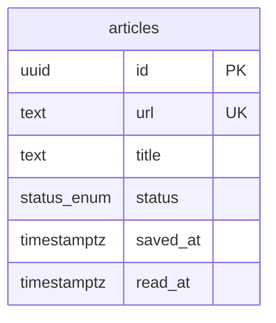

# クロスデバイス対応リーディングリスト管理ツール: 詳細設計書

## ステータス

Confirmed

## 日付

2026-03-03

## 入力文書

- 要件定義書: `docs/project-definition/requirements.md` (2026-02-19)
- アーキテクチャ設計書: `docs/project-definition/architecture.md` (2026-02-26)
- 開発規約書: `docs/project-definition/standards.md` (2026-02-27)
- 開発プロセス設計書: `docs/project-definition/development-process.md` (2026-02-27)

---

## 1. データベース設計

### 1.1 エンティティ関連図

MVPはシングルテーブル構成。テーブル間リレーションなし。

### 1.2 テーブル定義

#### articles

| カラム | 型 | 制約 | デフォルト | 導出元 |
|--------|------|------|----------|--------|
| `id` | `uuid` | PRIMARY KEY | `gen_random_uuid()` | architecture.md §6.2 |
| `url` | `text` | NOT NULL, UNIQUE | — | SR-001, SR-002, SR-010, architecture.md §6.2 |
| `title` | `text` | NOT NULL | — | SR-001, SR-002 |
| `status` | `status`（ENUM） | NOT NULL | `'unread'` | SR-004, SR-006, SR-007, architecture.md §6.1, §6.2 |
| `saved_at` | `timestamptz` | NOT NULL | `now()` | SR-003, architecture.md §6.2 |
| `read_at` | `timestamptz` | NULL 許容 | `NULL` | SR-006, SR-007, architecture.md §6.1 |

**補足**:
- `id`: アプリ側での UUID 生成は行わない。DB 側の `gen_random_uuid()` に委譲する（standards.md §5.1）
- `url`: UNIQUE 制約により B-Tree インデックスが自動生成される。重複チェック専用の個別インデックス設定は不要（architecture.md §6.2）
- TypeScript 側カラムエイリアス: `saved_at` → `savedAt`、`read_at` → `readAt`（standards.md §1.3 camelCase 規則）

### 1.3 Enum 定義

| 名前 | 値 | 導出元 |
|------|------|--------|
| `status` | `'unread'`, `'read'` | SR-004, SR-006, SR-007, architecture.md §6.2 |

PostgreSQL ENUM 型（`pgEnum`）として定義する。初期値は `'unread'`（保存時デフォルト）。将来の状態追加に拡張しやすく、クエリの可読性も高い（architecture.md §6.2）。

| 値 | 意味 | 初期値 |
|----|------|--------|
| `'unread'` | 未読（保存直後のデフォルト状態） | yes |
| `'read'` | 既読（明示的な既読操作後） | no |

### 1.4 インデックス定義

| 名前 | テーブル | カラム | 種別 | 導出元 |
|------|---------|--------|------|--------|
| `articles_url_key`（UNIQUE 制約自動生成） | `articles` | `url` | B-Tree (UNIQUE) | SR-010, architecture.md §6.2 |
| `idx_articles_status_saved_at` | `articles` | `(status, saved_at)` | B-Tree 複合 | SR-004, SR-018, architecture.md §6.2 |

**検索インデックスについて**: SR-009 のキーワード検索は `LIKE '%keyword%'` 部分一致によるシーケンシャルスキャンとする。想定データ上限 5,000 件でのスキャン所要時間は 10ms 以下と見込む（NFR-3 の検索 3 秒以内を十分に満たす）。5,000 件超または応答 1 秒超の場合は `pg_trgm` 拡張（GIN インデックス）の導入を判断する（architecture.md §6.2）。

### 1.5 マイグレーション対象

| # | 対象 | 内容 |
|---|------|------|
| 1 | ENUM 型 | `status` 型（`'unread'`, `'read'`）を作成 |
| 2 | テーブル | `articles` テーブルを全カラム・制約（PRIMARY KEY, NOT NULL, UNIQUE, DEFAULT）込みで作成 |
| 3 | インデックス | `idx_articles_status_saved_at` を `articles (status, saved_at)` に作成 |

具体的なファイル名・実行手順・ロールバック手順は task_implement で決定する。

---

## 2. サービス層設計

DI 境界は architecture.md の DI 設計方針に従い、task_implement で具体的なインターフェースを設計する。

### 2.1 ArticleService

コンストラクタ引数: `titleFetcher: ITitleFetcher`, `articleRepository: IArticleRepository`

Handler 層はファクトリ関数（`createArticleService()` 等）を通じて Service インスタンスを取得する（architecture.md §5.3）。

#### メソッド一覧

| メソッド | 引数 | 戻り値 | エラーケース | 関連SR |
|---------|------|--------|------------|--------|
| `save` | `url: string` | `Promise<SaveArticleResult>` | `AppError(duplicate)`: 重複URL / `AppError(system)`: DB 障害 | SR-001, SR-002, SR-010, SR-015 |
| `getUnreadArticles` | — | `Promise<Article[]>` | — | SR-004, SR-011, SR-012, SR-013 |
| `getReadArticles` | — | `Promise<Article[]>` | — | SR-018 |
| `markAsRead` | `id: string` | `Promise<void>` | `AppError(system)`: 対象不在 / DB 障害 | SR-006 |
| `markAsUnread` | `id: string` | `Promise<void>` | `AppError(system)`: 対象不在 / DB 障害 | SR-007 |
| `deleteArticle` | `id: string` | `Promise<void>` | `AppError(system)`: 対象不在 / DB 障害 | SR-008 |
| `searchArticles` | `keyword: string` | `Promise<Article[]>` | — | SR-009 |

Private メソッド:

| メソッド | 引数 | 処理 |
|---------|------|------|
| `checkDuplicate` | `url: string` | `articleRepository.findByUrl(url)` で存在チェック → 存在時 `AppError(kind: 'duplicate', message: 'この URL は既に保存されています')` を throw |

**SaveArticleResult 型** (`src/lib/types.ts` に配置): `{ article: Article; titleFetchFailed: boolean }`

- `titleFetchFailed: true` の場合、タイトル取得に失敗しており URL をタイトル代替として保存したことを示す

#### ビジネスルール

**save(url) の処理フロー**:

| # | ステップ | 条件 | アクション | 導出元 |
|---|---------|------|----------|--------|
| 1 | 重複チェック（アプリ層） | `findByUrl(url)` が結果を返す | `AppError(kind: 'duplicate', message: 'この URL は既に保存されています')` を throw | SR-010, architecture.md §9.1 |
| 2 | タイトル取得 | TitleFetcher 成功 | 取得したタイトルを使用して続行 | SR-001, SR-002 |
| 2 | タイトル取得 | TitleFetcher 失敗（タイムアウト 3 秒超過 / HTTP エラー / SSRF 拒否） | URL をタイトル代替として使用、`titleFetchFailed = true` に設定して続行。保存操作を中止しない | SR-015, architecture.md §5.1 |
| 3 | DB 書き込み | UNIQUE 制約違反（PostgreSQL 23505） | Repository 層が `AppError(kind: 'duplicate')` に変換して throw（並行リクエスト時のレースコンディション対応） | SR-010, architecture.md §9.1 |
| 4 | 返却 | — | `{ article, titleFetchFailed }` を返却 | — |

**その他のビジネスルール**:

| ルール | 条件 | アクション | 導出元 |
|--------|------|----------|--------|
| 既読化 | `markAsRead(id)` 実行時 | `status = 'read'`、`read_at = now()` を設定 | SR-006 |
| 未読戻し | `markAsUnread(id)` 実行時 | `status = 'unread'`、`read_at = NULL` を設定 | SR-007 |
| 物理削除 | `deleteArticle(id)` 実行時 | レコードを DELETE で物理削除（論理削除は使用しない） | SR-008, standards.md §5.3 |
| 未読件数・蓄積警告の導出 | `getUnreadArticles()` 結果取得後 | `unreadCount = unreadArticles.length`、`showWarning = unreadCount > 20`。これらの値の導出は Handler 層（ArticleListPage）の責務 | SR-011, SR-012, SR-013 |
| 検索対象 | `searchArticles(keyword)` 実行時 | 未読・既読を問わず全記事を対象とする | SR-009 |

#### トランザクション境界

| 操作 | スコープ | 分離レベル | 理由 |
|------|---------|----------|------|
| 全操作 | 暗黙的（単一 SQL 文ごと） | PostgreSQL デフォルト（READ COMMITTED） | シンプル CRUD・シングルユーザー構成で明示的トランザクション不要。UNIQUE 制約で最終保証 |

明示的トランザクション・ロックは使用しない。並行リクエスト時の重複保存は DB の UNIQUE 制約で最終保証する（standards.md §5.4）。

### 2.2 TitleFetcher

#### メソッド一覧

| メソッド | 引数 | 戻り値 | エラーケース | 関連SR |
|---------|------|--------|------------|--------|
| `fetchTitle` | `url: string` | `Promise<string>`（記事タイトル） | `AppError(title_fetch_failed)`: タイムアウト（3 秒）/ HTTP エラー / SSRF 拒否 | SR-001, SR-002, SR-015 |

#### ビジネスルール

| ルール | 条件 | アクション | 導出元 |
|--------|------|----------|--------|
| タイムアウト制御 | リクエスト開始から 3 秒経過 | AbortController で中断し `AppError(title_fetch_failed)` を throw | architecture.md §5.1 |
| SSRF 対策: プライベート IP 拒否 | リクエスト先 IP が RFC1918（10.0.0.0/8、172.16.0.0/12、192.168.0.0/16）/ ループバック（127.0.0.0/8）/ リンクローカル（169.254.0.0/16）のいずれか | リクエストを拒否し `AppError(title_fetch_failed)` を throw | architecture.md §5.1 |
| SSRF 対策: HTTPS 以外拒否 | リクエスト先プロトコルが HTTPS 以外 | リクエストを拒否し `AppError(title_fetch_failed)` を throw | architecture.md §5.1 |
| SSRF 対策: リダイレクト追跡 | HTTP リダイレクトが発生した場合 | リダイレクト先 URL にも同様のフィルタリングを適用する（または `redirect: 'manual'` でリダイレクト追跡を無効化） | architecture.md §5.1 |

SSRF 対策は TitleFetcher 内部で実施する。Handler 層での追加フィルタリングは不要（architecture.md §9.3）。

---

## 3. API インターフェース設計

### 3.1 Server Action

全 Server Action 共通:
- 冒頭でセッション検証を実施する。未認証時は `ActionResult` でエラーを返却する（architecture.md §7.2）
- 状態変更操作（save / markAsRead / markAsUnread / delete）の成功時に `revalidatePath('/')` + `revalidatePath('/search')` を実行する（architecture.md §9.2）

#### saveArticleAction

- トリガー元: ArticleSaveForm（フォーム送信）
- 入力: `FormData` の `url` フィールド。以下のルールで Zod 検証を実施する

  | フィールド | ルール | エラーメッセージ | 関連SR |
  |-----------|--------|-------------|--------|
  | `url` | `string().min(1, ...)` | `"URLを入力してください"` | SR-016 |
  | `url` | `string().url(...)` | `"URLの形式が正しくありません"` | SR-014 |

- 出力型: `ActionResult<SaveArticleResult>`
- 認証: セッション検証（必須）
- エラーレスポンス:

  | エラー種別 | error 文字列 |
  |---------|------------|
  | URL 空入力（SR-016） | `"URLを入力してください"` |
  | URL 形式不正（SR-014） | `"URLの形式が正しくありません"` |
  | 重複 URL（SR-010） | `"この URL は既に保存されています"` |
  | DB 障害等（system） | `"保存に失敗しました"` |

- タイトル取得失敗時: `{ success: true, data: { article, titleFetchFailed: true } }`（保存は成功）。Handler 層は「タイトルを取得できませんでした（URLで保存しました）」のインライン通知を表示する（SR-015）
- 関連SR: SR-001, SR-010, SR-014, SR-015, SR-016

#### markAsReadAction

- トリガー元: ArticleCardActions（Client Component）
- 入力: `id: string`。`z.string().uuid("記事IDの形式が不正です")` で Zod 検証を実施
- 出力型: `ActionResult`
- 認証: セッション検証（必須）
- エラーレスポンス: DB 障害等のシステムエラー → `{ success: false, error: "操作に失敗しました" }`
- 関連SR: SR-006

#### markAsUnreadAction

- トリガー元: ArticleCardActions（Client Component）
- 入力: `id: string`。`z.string().uuid("記事IDの形式が不正です")` で Zod 検証を実施
- 出力型: `ActionResult`
- 認証: セッション検証（必須）
- エラーレスポンス: DB 障害等のシステムエラー → `{ success: false, error: "操作に失敗しました" }`
- 関連SR: SR-007

#### deleteArticleAction

- トリガー元: ArticleCardActions（Client Component）
- 入力: `id: string`。`z.string().uuid("記事IDの形式が不正です")` で Zod 検証を実施
- 出力型: `ActionResult`
- 認証: セッション検証（必須）
- エラーレスポンス: DB 障害等のシステムエラー → `{ success: false, error: "削除に失敗しました" }`
- 関連SR: SR-008

### 3.2 Route Handler

#### POST /api/share

- 目的: Android 共有メニュー経由で記事 URL を受け取り保存する（Web Share Target API）（SR-002）
- リクエスト: `multipart/form-data`（Web Share Target API 標準）
  - `url` フィールド（必須）: 保存する記事 URL
  - `title` フィールド（任意）: 共有元のページタイトル（本システムでは TitleFetcher による取得を優先するため参考値のみ）
  - `text` フィールド（任意）: 共有元のテキスト（本システムでは使用しない）
- レスポンス:

  | 条件 | ステータス | レスポンス先 |
  |------|---------|---------|
  | 成功 | `302 Redirect` | `/` |
  | 重複 URL | `302 Redirect` | `/?error=duplicate` |
  | バリデーション失敗 | `302 Redirect` | `/?error=invalid_url` |
  | システムエラー | `302 Redirect` | `/?error=system` |
  | CSRF 失敗 | `403 Forbidden` | — |
  | 未認証 | `302 Redirect` | ログインページ |

- 認証: Auth.js Middleware によるセッション検証（必須）+ Handler 冒頭での追加セッション検証
- CSRF: Origin ヘッダー検証。`request.headers.get('origin')` を `process.env.URL`（Netlify 提供デプロイドメイン）と照合し、不一致の場合は `403` を返す（architecture.md §7.2, standards.md §4.2）
- バリデーション: `url` フィールドを `saveArticleAction` と同一の `articleUrlSchema` で Zod 検証
- 処理フロー: Origin 検証 → セッション検証 → Zod バリデーション → `articleService.save(url)` → `revalidatePath('/')` → 302 リダイレクト
- 関連IR: IR-001
- 関連SR: SR-002, SR-010, SR-015

#### GET /api/ping

- 目的: Neon コールドスタート防止のための warm-up ping および死活確認（architecture.md §9.5）
- リクエスト: なし（クエリパラメータなし）
- レスポンス:

  | 条件 | ステータス | ボディ |
  |------|---------|--------|
  | 正常 | `200 OK` | `{ "status": "ok" }` |
  | 認証失敗 | `401 Unauthorized` | — |
  | DB 接続失敗 | `503 Service Unavailable` | — |

- 認証: `Authorization: Bearer <PING_SECRET>` ヘッダーによるトークン検証。Auth.js Middleware の認証対象外（middleware の `matcher` で除外）（architecture.md §7.2）
- CSRF: N/A（Auth.js セッション認証対象外のため）

### 3.3 Server Component データ契約

| コンポーネント | データ入力 | ソース Service メソッド | 関連SR |
|--------------|----------|---------------------|--------|
| ArticleListPage | `unreadArticles: Article[]`、`readArticles: Article[]`、`unreadCount: number`（= `unreadArticles.length`）、`showWarning: boolean`（= `unreadCount > 20`） | `articleService.getUnreadArticles()`、`articleService.getReadArticles()` | SR-004, SR-011, SR-012, SR-013, SR-018 |
| SearchPage | `results: Article[]`（`q` が存在する場合のみ取得）、`keyword: string \| undefined`（URL searchParams `q` から取得） | `articleService.searchArticles(q)`（`q` 存在時のみ） | SR-009 |
| ArticleCard | `article: Article` | — （親コンポーネントから props で受け取る） | SR-003, SR-006, SR-007, SR-008 |
| ArticleCardActions | `articleId: string`、`status: 'unread' \| 'read'` | — （ArticleCard から props で受け取る） | SR-006, SR-007, SR-008 |

**SearchPage の検索方式**: 検索は GET ベースの URL 遷移（`/search?q=keyword`）で実現する。Server Action は使用しない（読み取り操作のため）（design-decisions.md 3-3）。

---

## 4. バッチ処理・非同期処理設計

該当なし。MVP スコープ内にバッチ処理・非同期ジョブは存在しない（requirements.md §5.3）。

---

## 5. 型定義方針

TypeScript 型定義は §1-3 の仕様から task_implement で導出する。
- エンティティ型: §1.2 テーブル定義から導出（Drizzle ORM の `InferSelectModel` を活用）
- DTO 型: §3 の入出力仕様から導出
- Enum 型: §1.3 の Enum 定義から導出

### エラー種別一覧

| kind | 発生層 | 説明 |
|------|--------|------|
| `validation` | Handler 層（Zod） | 入力形式の不正（URL 形式不正、空入力、ID 形式不正） |
| `duplicate` | Service 層（重複チェック）/ Repository 層（UNIQUE 制約違反 23505） | 重複 URL 保存の試み |
| `title_fetch_failed` | Service 層（TitleFetcher 内部） | タイムアウト（3 秒）/ HTTP エラー / SSRF 拒否。ArticleService 内部でフォールバック処理済み（save メソッドは外部へ throw しない） |
| `system` | Repository 層 / Service 層 | DB 障害等の予期しない障害、対象記事不在 |

各層のエラー処理パターン:
- Handler 層（Server Actions / Route Handlers）: `AppError` を捕捉し `ActionResult` に変換して `return` する。`throw` しない
- Service 層: ビジネスルール違反時に `AppError` を `throw` する
- Repository 層: DB 固有エラー（PostgreSQL `23505` 等）を `AppError` に変換して `throw` する

---

## 6. 状態遷移設計

### 6.1 状態定義

| エンティティ | ステータスカラム | 有効な状態 | 初期状態 |
|------------|---------------|----------|---------|
| Article（articles テーブル） | `status`（`statusEnum`） | `'unread'`（未読）, `'read'`（既読） | `'unread'`（保存時デフォルト） |

### 6.2 遷移マトリクス

| From → To | トリガー | ガード条件 | Service メソッド | API エンドポイント |
|-----------|---------|----------|----------------|-----------------|
| （初期）→ `unread` | 記事保存（SR-001, SR-002） | なし | `ArticleService.save(url)` | `saveArticleAction` / `POST /api/share` |
| `unread` → `read` | 既読操作（SR-006） | なし（べき等） | `ArticleService.markAsRead(id)` | `markAsReadAction` |
| `read` → `unread` | 未読戻し操作（SR-007） | なし（べき等） | `ArticleService.markAsUnread(id)` | `markAsUnreadAction` |
| `unread` → （削除） | 削除操作（SR-008） | なし | `ArticleService.deleteArticle(id)` | `deleteArticleAction` |
| `read` → （削除） | 削除操作（SR-008） | なし | `ArticleService.deleteArticle(id)` | `deleteArticleAction` |

**ガード条件なしの理由**: UI が記事の状態に応じた操作ボタンのみ表示するため、同一状態への遷移は通常発生しない。万一発生しても UPDATE は冪等（design-decisions.md §2-4）。

**遷移時の副作用**:
- `（初期）→ unread`: `saved_at = now()`、`read_at = NULL`（INSERT）
- `unread → read`: `read_at = now()`（UPDATE）
- `read → unread`: `read_at = NULL`（UPDATE）
- 削除: レコード物理削除（DELETE）

---

## 7. トレーサビリティ

### 7.1 SR → 仕様マッピング

| SR-ID | DB 仕様 | Service 仕様 | API 仕様 |
|-------|---------|------------|---------|
| SR-001 | §1.2 articles.url, articles.title, articles.saved_at | §2.1 ArticleService.save | §3.1 saveArticleAction |
| SR-002 | §1.2 articles.url, articles.title, articles.saved_at | §2.1 ArticleService.save | §3.2 POST /api/share |
| SR-003 | §1.2 articles.saved_at（NOT NULL, DEFAULT now()） | — | — |
| SR-004 | §1.4 idx_articles_status_saved_at | §2.1 ArticleService.getUnreadArticles | §3.3 ArticleListPage |
| SR-005 | §1.2 articles テーブル（Neon PostgreSQL による共有 DB） | — | — |
| SR-006 | §1.2 articles.status, articles.read_at | §2.1 ArticleService.markAsRead, §6.2 unread→read | §3.1 markAsReadAction |
| SR-007 | §1.2 articles.status, articles.read_at | §2.1 ArticleService.markAsUnread, §6.2 read→unread | §3.1 markAsUnreadAction |
| SR-008 | §1.2 articles テーブル（物理削除） | §2.1 ArticleService.deleteArticle | §3.1 deleteArticleAction |
| SR-009 | §1.4 検索インデックス（LIKE 部分一致、シーケンシャルスキャン） | §2.1 ArticleService.searchArticles | §3.3 SearchPage |
| SR-010 | §1.2 articles.url（UNIQUE 制約）、§1.4 articles_url_key | §2.1 ArticleService.checkDuplicate（private）, save ビジネスルール（二段構え） | §3.1 saveArticleAction, §3.2 POST /api/share |
| SR-011 | §1.4 idx_articles_status_saved_at | §2.1 ArticleService.getUnreadArticles（unreadCount = unreadArticles.length を Handler 層が導出） | §3.3 ArticleListPage（unreadCount 表示） |
| SR-012 | §1.4 idx_articles_status_saved_at | §2.1 ArticleService.getUnreadArticles（unreadCount = 0 を Handler 層が導出） | §3.3 ArticleListPage（unreadCount = 0 表示） |
| SR-013 | — | §2.1 ArticleService.getUnreadArticles（Handler 層が unreadCount > 20 を判定） | §3.3 ArticleListPage（showWarning 表示） |
| SR-014 | — | — | §3.1 saveArticleAction（url.url() バリデーション） |
| SR-015 | — | §2.1 TitleFetcher.fetchTitle（タイムアウト 3 秒）、ArticleService.save フォールバック（title = url, titleFetchFailed = true） | §3.1 saveArticleAction（titleFetchFailed = true 時インライン通知） |
| SR-016 | — | — | §3.1 saveArticleAction（url.min(1) バリデーション） |
| SR-017 | §1.2 articles テーブル（Neon PostgreSQL 即時永続化） | — | 書き込み操作後の revalidatePath により次回アクセス時に最新状態を取得 |
| SR-018 | §1.4 idx_articles_status_saved_at | §2.1 ArticleService.getReadArticles | §3.3 ArticleListPage |

### 7.2 NFR 反映

| NFR-ID | 反映先仕様要素 | 対応方法 |
|--------|-------------|---------|
| NFR-1 | §1.2（Neon 無料枠）、§3.2 GET /api/ping（warm-up ping でコンピュート消費を最小化） | Netlify Starter ($0) + Neon 無料枠 ($0) + OSS 技術スタックで月額 0 円を実現。Claude API は MVP スコープ外 |
| NFR-2 | §1.5 マイグレーション計画、§3.2 全 Route Handler | `git push origin main` 1 コマンドで Netlify 自動デプロイ。マイグレーション含むデプロイのみ `pnpm drizzle-kit migrate` を先行実行 |
| NFR-3 | §1.4 インデックス定義、§2.2 TitleFetcher タイムアウト 3 秒、§3.2 GET /api/ping | 一覧表示: `idx_articles_status_saved_at` で高速ソート。記事保存: TitleFetcher 最大 3 秒 + DB 書き込み約 0.5 秒 = コールドスタートなし時約 3.5 秒（NFR-3 の 5 秒以内）。検索: 想定 5,000 件でシーケンシャルスキャン 10ms 以下 |
| NFR-4 | §3.1 全 Server Action（セッション検証）、§3.2 POST /api/share（CSRF Origin 検証）、§3.2 GET /api/ping（PING_SECRET トークン検証） | Auth.js Middleware で全ページの認証を強制。`callbacks.signIn` で ALLOWED_EMAIL 照合によるシングルユーザー制限。シークレット類は環境変数管理 |
| NFR-5 | §1.2 articles テーブル（Neon PostgreSQL 永続化） | Neon PITR（約 24 時間保持）+ pg_dump 週次補完バックアップ。RPO: 直近バックアップ時点（最大 1 週間）、RTO: 1 日以内 |
| NFR-6 | §3.2 POST /api/share（Web Share Target API）、§3.1 saveArticleAction | スマホ: Android 共有メニュー → WebShareTargetHandler → 保存完了（2 ステップ以内）。PC: URL コピー → フォームにペースト → 保存実行（3 ステップ以内） |

### 7.3 IR → API マッピング

| IR-ID | API 仕様参照 |
|-------|------------|
| IR-001 | §3.2 POST /api/share（WebShareTargetHandler: Android 共有メニューから URL 文字列を受信。`multipart/form-data` 形式） |
| IR-002 | §3.3 ArticleListPage, SearchPage（スマートフォン・PC 両対応の Server Component レンダリング。Tailwind CSS モバイルファースト） |
| IR-003 | §3.1 全 Server Action（セッション検証）、Auth.js Middleware（全ページ認証。未認証アクセスはログインページへリダイレクト） |
