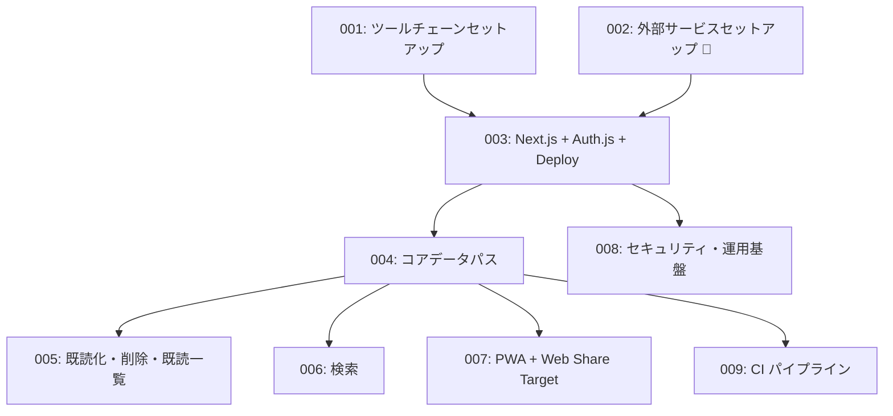

# タスクリスト: クロスデバイス対応リーディングリスト管理ツール

## ステータス

Draft

## 日付

2026-03-03

## 概要

- タスク数: 9
- チェックポイント: 2箇所
- 入力文書:
  - `docs/project-definition/problem-statement.md` (2026-02-17)
  - `docs/project-definition/requirements.md` (2026-02-19)
  - `docs/project-definition/architecture.md` (2026-02-26)
  - `docs/project-definition/standards.md` (2026-02-27)
  - `docs/project-definition/development-process.md` (2026-02-27)
  - `docs/project-definition/detailed-design.md` (2026-03-03)

## 依存関係グラフ

## カバレッジサマリ

| 要件種別 | カバー | 合計 |
|---------|-------|------|
| SR | 18 | 18 |
| NFR | 6 | 6 |
| IR | 3 | 3 |

## タスク一覧

| # | タイトル | blocked_by |
|---|---------|-----------|
| 001 | ツールチェーンセットアップ | — |
| 002 | 外部サービスセットアップ | — |
| 003 | Next.jsプロジェクト初期化 + Auth.js認証設定 + Netlifyデプロイ | 001, 002 |

> **チェックポイント1**: 基盤構築完了 — 認証済みアプリがNetlify上にデプロイされ、Google OAuthでログインできる状態を確認

| # | タイトル | blocked_by |
|---|---------|-----------|
| 004 | コアデータパス — 記事保存・未読一覧表示（DB〜UI全レイヤー） | 003 |

> **チェックポイント2**: コアデータパス完了 — 記事の保存と未読一覧表示がE2Eで動作する状態を確認

| # | タイトル | blocked_by |
|---|---------|-----------|
| 005 | 記事管理操作 — 既読化・未読戻し・削除・既読一覧 | 004 |
| 006 | 検索 | 004 |
| 007 | PWA + Web Share Target | 004 |
| 008 | セキュリティ・運用基盤 | 003 |
| 009 | GitHub Actions CIパイプライン | 004 |

---

## タスク詳細

### タスク001: ツールチェーンセットアップ

**blocked_by**: なし

#### 成果物

- [ ] Biome 設定（biome.json: recommended ルールセット、noVar・useConst・noDangerouslySetInnerHtml 有効化、organizeImports 有効化）
- [ ] TypeScript 設定（tsconfig.json: strict: true、noUncheckedIndexedAccess: true、@/ パスエイリアス設定）
- [ ] VS Code 設定ファイル一式（.vscode/settings.json: Biome 拡張有効化・保存時自動フォーマット設定）
- [ ] VS Code 拡張機能リスト（.vscode/extensions.json: Biome、Playwright Test Explorer 等）
- [ ] VS Code デバッグ設定（.vscode/launch.json: Next.js サーバーサイドデバッグ用 Node.js アタッチ設定）

#### 受け入れ条件

- [ ] `pnpm biome check` がエラーなしで通過する
- [ ] `tsc --noEmit` が型エラーなしで通過する
- [ ] .vscode/settings.json、.vscode/extensions.json、.vscode/launch.json の 3 ファイルが存在する
- [ ] biome.json に `recommended: true`、`noVar`、`useConst`、`noDangerouslySetInnerHtml`、`organizeImports` が設定されている

#### 入力

- `standards.md` §1.1（Biome 設定方針）
- `standards.md` §1.2（TypeScript 設定）
- `standards.md` §3.6（エイリアスパス）
- `development-process.md` §5.1（デバッグ環境・VS Code 設定ファイル）

---

### タスク002: 外部サービスセットアップ

**blocked_by**: なし

#### 成果物

- [ ] 外部: Neon PostgreSQL プロジェクト作成（Web コンソールで操作）および DATABASE_URL 取得
- [ ] 外部: Google OAuth クライアント ID・シークレット取得（Google Cloud Console で操作）
- [ ] 外部: Netlify サイト作成・GitHub リポジトリ連携（Netlify コンソールで操作）

#### 受け入れ条件

- [ ] DATABASE_URL 環境変数が取得済みである（Neon PostgreSQL 接続文字列形式であること）
- [ ] GOOGLE_CLIENT_ID および GOOGLE_CLIENT_SECRET が取得済みである
- [ ] Netlify サイトが作成され、GitHub リポジトリと連携されている（Netlify コンソールでデプロイ設定が確認できる）

#### 入力

- `architecture.md` §8.1（デプロイ構成）
- `architecture.md` §8.3（コスト設計: Netlify Starter・Neon 無料枠）
- `standards.md` §3.5（確定済み環境変数一覧）
- `requirements.md` §4（制約: NFR-1 月額0円）

---

### タスク003: Next.jsプロジェクト初期化 + Auth.js認証設定 + Netlifyデプロイ

**blocked_by**: Task 001（ツールチェーンセットアップ）, Task 002（外部サービスセットアップ）

#### 成果物

- [ ] Next.js App Router プロジェクト初期化（pnpm、src/ ディレクトリ構成、app/(auth)/・app/(app)/ ルートグループ）
- [ ] Auth.js + Google OAuth 認証設定（callbacks.signIn での ALLOWED_EMAIL 照合によるシングルユーザー制限・events.signInFailure ログ出力）
- [ ] AuthGuard（middleware.ts: Auth.js Middleware による全ページ認証チェック、/api/ping の認証対象外設定）
- [ ] Netlify デプロイ設定（netlify.toml またはビルド設定）
- [ ] プロジェクトドキュメント（README.md: セットアップ手順・開発コマンド一覧・pg_dump バックアップ手順記載）
- [ ] CLAUDE.md（AI コーディング支援用コンテキスト）
- [ ] .env.example（環境変数キー一覧: DATABASE_URL, ALLOWED_EMAIL, GOOGLE_CLIENT_ID, GOOGLE_CLIENT_SECRET, AUTH_SECRET, PING_SECRET）
- [ ] public/robots.txt（全クローラー拒否設定）

#### 受け入れ条件

- [ ] Netlify 上にデプロイされたアプリへのアクセスで、Google OAuth ログイン画面にリダイレクトされる
- [ ] ALLOWED_EMAIL に設定したメールアドレスの Google アカウントでログインできる
- [ ] ALLOWED_EMAIL と異なるメールアドレスのアカウントでは認証が拒否される
- [ ] 未認証状態でアプリ画面へのアクセスを試みると、ログインページへリダイレクトされる
- [ ] `pnpm biome check` がエラーなしで通過する
- [ ] .env.example に 6 つの環境変数キーが全て記載されている

#### 入力

- `architecture.md` §7.1（認証フロー）
- `architecture.md` §7.2（アクセス制御方針・middleware 除外パス）
- `architecture.md` §8.1（デプロイ構成）
- `requirements.md` §8（NFR-1, NFR-2, NFR-4）
- `requirements.md` §10（IR-003）
- `standards.md` §3.2（ディレクトリ構成）
- `standards.md` §3.5（.env 戦略・確定済み環境変数一覧）
- `development-process.md` §1.5（ドキュメント管理）
- `development-process.md` §5.4（ドキュメント戦略）

---

### タスク004: コアデータパス — 記事保存・未読一覧表示（DB〜UI全レイヤー）

**blocked_by**: Task 003（Next.jsプロジェクト初期化 + Auth.js認証設定 + Netlifyデプロイ）

#### 成果物

- [ ] Drizzle ORM スキーマ（src/lib/db/schema.ts: articles テーブル・status ENUM・(status, saved_at) 複合インデックス定義）
- [ ] Drizzle Kit 設定（drizzle.config.ts）
- [ ] DB マイグレーション（status ENUM 型作成・articles テーブル作成・インデックス作成）
- [ ] DI 用インターフェース定義（src/lib/interfaces/: IArticleRepository・ITitleFetcher）
- [ ] ArticleRepository（create, findByUrl, findByStatus の各クエリ、PostgreSQL 23505 エラーを AppError(duplicate) に変換）
- [ ] TitleFetcher（fetchTitle メソッド: タイムアウト 3 秒・SSRF 対策・HTTPS のみ許可）
- [ ] ArticleService（save, getUnreadArticles, checkDuplicate private メソッドのみ: コアデータパスに必要な機能のみ）
- [ ] 共通型定義（src/lib/types.ts: ActionResult, SaveArticleResult）
- [ ] エラー型定義（src/lib/errors.ts: AppError）
- [ ] saveArticleAction（URL バリデーション: min(1)・url()、ArticleService.save 呼び出し、revalidatePath、titleFetchFailed 時インライン通知）
- [ ] ArticleSaveForm（URL 入力フォーム、エラーメッセージ表示、SR-014・SR-016 対応）
- [ ] ArticleListPage（未読一覧表示・未読件数表示・蓄積警告 unreadCount > 20、SR-004・SR-011・SR-012・SR-013 対応）
- [ ] ArticleCard（表示のみ: タイトル・保存日時表示。操作ボタンは Task 005 で追加）
- [ ] Vitest 設定（vitest.config.ts）
- [ ] Playwright 設定（playwright.config.ts）
- [ ] Unit テスト（ArticleService・TitleFetcher のビジネスロジック検証、モック注入を使用）
- [ ] Integration テスト（ArticleRepository の Drizzle ORM クエリと実 DB の結合検証）
- [ ] E2E テスト（記事保存・未読一覧表示の主要フロー検証）

#### 受け入れ条件

- [ ] PC ブラウザからログイン済み状態で URL を入力して保存操作を実行すると、未読一覧に記事タイトルと保存日時が表示される（SR-001, SR-004）
- [ ] 既に保存済みの URL を再度保存しようとすると、重複警告メッセージが表示され保存されない（SR-010）
- [ ] 空の URL で保存を試みると「URLを入力してください」エラーが表示される（SR-016）
- [ ] 不正な URL 形式で保存を試みると「URLの形式が正しくありません」エラーが表示される（SR-014）
- [ ] タイトル取得に失敗した場合でも記事は保存され、「タイトルを取得できませんでした（URLで保存しました）」の通知が表示される（SR-015）
- [ ] 未読件数が表示され、20 件を超えると蓄積警告が表示される（SR-011, SR-012, SR-013）
- [ ] `pnpm vitest run` で Unit テストおよび Integration テストが全パスする
- [ ] `pnpm playwright test` で E2E テストが全パスする

#### 入力

- `detailed-design.md` §1（DB 設計: テーブル定義・ENUM・インデックス・マイグレーション対象）
- `detailed-design.md` §2.1（ArticleService メソッド一覧・ビジネスルール・save 処理フロー）
- `detailed-design.md` §2.2（TitleFetcher メソッド一覧・ビジネスルール）
- `detailed-design.md` §3.1（saveArticleAction: 入力・出力型・バリデーション・エラーレスポンス）
- `detailed-design.md` §3.3（ArticleListPage・ArticleCard データ契約）
- `detailed-design.md` §5（型定義方針・エラー種別一覧）
- `architecture.md` §5.1（コンポーネント一覧・TitleFetcher SSRF 対策詳細・失敗時フォールバック）
- `architecture.md` §5.3（テスト設計方針・DI 設計方針）
- `architecture.md` §5.4（ディレクトリ構造）
- `architecture.md` §6.2（スキーマ設計方針）
- `architecture.md` §9.1（エラーハンドリング方針・重複チェック二段構え設計）
- `standards.md` §5.1（スキーマ設計: Drizzle ORM 実装例）
- `standards.md` §5.2（バリデーション戦略・Zod スキーマ例）
- `development-process.md` §2.1（テスト投資配分）
- `development-process.md` §2.4（テストファイル配置）
- `development-process.md` §2.5（テストデータ管理）
- `development-process.md` §2.6（モック戦略）

---

### タスク005: 記事管理操作 — 既読化・未読戻し・削除・既読一覧

**blocked_by**: Task 004（コアデータパス — 記事保存・未読一覧表示）

#### 成果物

- [ ] ArticleService への markAsRead, markAsUnread, deleteArticle, getReadArticles メソッド追加 — Task 004 で作成済みの ArticleService に操作系メソッドを実装
- [ ] ArticleRepository への update（status・read_at 更新）, delete（物理削除）メソッド追加 — Task 004 で作成済みの ArticleRepository に追加クエリを実装
- [ ] markAsReadAction・markAsUnreadAction・deleteArticleAction（Server Actions: UUID バリデーション・revalidatePath 含む）
- [ ] ArticleCardActions（Client Component 新規作成: 既読化・未読戻し・削除の操作ボタン、Server Actions 呼び出し）
- [ ] ArticleCard への ArticleCardActions 統合 — Task 004 で作成済みの ArticleCard（表示のみ）に操作ボタン部分を追加
- [ ] ArticleListPage への既読一覧タブ/セクション追加 — Task 004 で作成済みの ArticleListPage に既読一覧（SR-018）を追加
- [ ] E2E テスト追加（既読化・未読戻し・削除・既読一覧表示のフロー検証）

#### 受け入れ条件

- [ ] 未読記事の既読化ボタンを押すと、未読一覧から消えて既読一覧に表示される（SR-006）
- [ ] 既読記事の未読戻しボタンを押すと、既読一覧から消えて未読一覧に再表示される（SR-007）
- [ ] 記事の削除ボタンを押すと、未読・既読の両一覧から消える（SR-008）
- [ ] 既読一覧画面を開くと既読状態の記事一覧が表示される（SR-018）
- [ ] `pnpm vitest run` でテストが全パスする
- [ ] `pnpm playwright test` で E2E テストが全パスする

#### 入力

- `detailed-design.md` §2.1（ArticleService: markAsRead・markAsUnread・deleteArticle・getReadArticles メソッド仕様・ビジネスルール）
- `detailed-design.md` §3.1（markAsReadAction・markAsUnreadAction・deleteArticleAction 仕様）
- `detailed-design.md` §3.3（ArticleListPage・ArticleCard・ArticleCardActions データ契約）
- `detailed-design.md` §6.2（遷移マトリクス・遷移時の副作用）
- `architecture.md` §5.1（ArticleCard・ArticleCardActions コンポーネント設計）
- `architecture.md` §9.1（エラーハンドリング方針）
- `architecture.md` §9.2（revalidatePath キャッシュ無効化）
- `standards.md` §5.3（物理削除の採用）

---

### タスク006: 検索

**blocked_by**: Task 004（コアデータパス — 記事保存・未読一覧表示）

#### 成果物

- [ ] ArticleService への searchArticles メソッド追加 — Task 004 で作成済みの ArticleService に検索メソッドを実装
- [ ] ArticleRepository への searchByKeyword（LIKE 部分一致検索）クエリ追加 — Task 004 で作成済みの ArticleRepository に検索クエリを実装
- [ ] SearchPage（/search?q=keyword: GET ベース URL 遷移、未読・既読問わず全記事を対象とした検索結果一覧表示）
- [ ] E2E テスト追加（キーワード検索フローの検証）

#### 受け入れ条件

- [ ] 検索キーワードを入力して検索を実行すると、タイトルまたは URL に部分一致する記事が未読・既読を問わず一覧表示される（SR-009）
- [ ] 検索は GET ベースの URL 遷移（/search?q=keyword）で動作し、ブラウザバックで前の画面に戻れる
- [ ] 検索結果が 3 秒以内に表示される（NFR-3）
- [ ] `pnpm playwright test` で E2E テストが全パスする

#### 入力

- `detailed-design.md` §2.1（ArticleService.searchArticles メソッド仕様）
- `detailed-design.md` §3.3（SearchPage データ契約・検索方式）
- `architecture.md` §5.1（SearchPage コンポーネント設計）
- `architecture.md` §6.2（検索方式: LIKE 部分一致・シーケンシャルスキャン・pg_trgm 判断基準）
- `requirements.md` §8（SR-009: 検索要件）

---

### タスク007: PWA + Web Share Target

**blocked_by**: Task 004（コアデータパス — 記事保存・未読一覧表示）

#### 成果物

- [ ] PWA 設定（public/manifest.json: アプリ名・アイコン・Web Share Target 設定含む）
- [ ] Service Worker 設定（Network First キャッシュ戦略、Web Share Target API 実現に必要な最小限の構成）
- [ ] WebShareTargetHandler（POST /api/share Route Handler: Origin ヘッダー検証 CSRF 対策・セッション検証・Zod バリデーション・ArticleService.save 呼び出し・302 リダイレクト）

#### 受け入れ条件

- [ ] public/manifest.json が配置され、ブラウザの PWA インストール機能が有効化される（manifest.json が正しく配信される）
- [ ] Android 端末の共有メニューから記事 URL を送信したとき、記事が保存されて未読一覧に表示される（SR-002）
- [ ] 許可ドメイン以外からの POST /api/share リクエストが 403 Forbidden で拒否される（CSRF 対策）
- [ ] 未認証状態での POST /api/share リクエストがログインページへリダイレクトされる
- [ ] 保存操作は Android 共有メニューからの 2 ステップ以内で完了する（NFR-6）

#### 入力

- `detailed-design.md` §3.2（POST /api/share Route Handler 仕様: リクエスト形式・レスポンス・認証・CSRF・バリデーション・処理フロー）
- `architecture.md` §5.1（WebShareTargetHandler コンポーネント設計）
- `architecture.md` §7.2（CSRF 保護: Origin ヘッダー検証）
- `standards.md` §4.2（CSRF 対策: WebShareTargetHandler の実装パターン）
- `development-process.md` §4.9（Service Worker 設定）
- `requirements.md` §8（SR-002, IR-001, NFR-6）

---

### タスク008: セキュリティ・運用基盤

**blocked_by**: Task 003（Next.jsプロジェクト初期化 + Auth.js認証設定 + Netlifyデプロイ）

#### 成果物

- [ ] HTTP セキュリティヘッダー設定（next.config.js: X-Frame-Options: DENY, X-Content-Type-Options: nosniff, Referrer-Policy: strict-origin-when-cross-origin）
- [ ] Error Boundary（app/error.tsx・app/global-error.tsx: クライアントコンポーネントの未処理エラー捕捉）
- [ ] warm-up ping エンドポイント（GET /api/ping: SELECT 1 軽量クエリ・PING_SECRET トークン検証・401/503 エラーレスポンス）
- [ ] gitleaks 導入
- [ ] lefthook.yml（pre-commit フック: Biome check + gitleaks の設定）
- [ ] README.md へのバックアップ手順追記（NFR-5: pg_dump 週次バックアップ手順）

#### 受け入れ条件

- [ ] レスポンスヘッダーに X-Frame-Options: DENY, X-Content-Type-Options: nosniff, Referrer-Policy: strict-origin-when-cross-origin が含まれる（curl または DevTools で確認）
- [ ] app/error.tsx と app/global-error.tsx が存在する
- [ ] 正しい PING_SECRET を Authorization ヘッダーに付与した GET /api/ping リクエストが 200 OK を返す
- [ ] 不正な PING_SECRET での GET /api/ping リクエストが 401 を返す
- [ ] git commit 時に lefthook の pre-commit フック（Biome check + gitleaks）が実行される
- [ ] lefthook.yml が存在し、pre-commit フック設定が記載されている

#### 入力

- `detailed-design.md` §3.2（GET /api/ping 仕様: 認証・レスポンス）
- `architecture.md` §7.2（middleware 除外パス: /api/ping）
- `architecture.md` §9.1（Error Boundary 配置: error.tsx・global-error.tsx）
- `architecture.md` §9.5（warm-up ping 設計）
- `standards.md` §4.5（HTTP セキュリティヘッダー設定）
- `development-process.md` §4.5（依存関係の脆弱性管理: gitleaks・lefthook pre-commit フック構成）
- `requirements.md` §9（NFR-3, NFR-4, NFR-5）

---

### タスク009: GitHub Actions CIパイプライン

**blocked_by**: Task 004（コアデータパス — 記事保存・未読一覧表示）

#### 成果物

- [ ] GitHub Actions ワークフロー設定（Stage 1: Biome check + tsc --noEmit + Unit tests + gitleaks + pnpm audit / Stage 2: Integration tests + E2E tests + Build verification）
- [ ] .github/dependabot.yml（npm 依存関係の週次自動更新設定）

#### 受け入れ条件

- [ ] main ブランチへの push で GitHub Actions CI パイプラインが起動する
- [ ] Stage 1（Biome lint/format check・TypeScript type check・Unit tests・gitleaks・pnpm audit）が正常に実行される
- [ ] Stage 1 成功後に Stage 2（Integration tests・E2E tests・Build verification）が実行される
- [ ] Stage 1 のいずれかのチェックが失敗した場合、Stage 2 が実行されない
- [ ] .github/dependabot.yml が存在し、npm パッケージの週次更新設定が記載されている

#### 入力

- `development-process.md` §2.8（CI でのテスト実行戦略: 2 ステージ構成）
- `development-process.md` §3.1（CI/CD プラットフォーム）
- `development-process.md` §3.2（CI パイプライン構成: 各ジョブ・トリガー・コマンド）
- `development-process.md` §4.5（依存関係の脆弱性管理: gitleaks・pnpm audit・dependabot.yml 設定例）
- `development-process.md` §3.6（シークレット管理 CI/CD 内: GitHub Actions Secrets）
